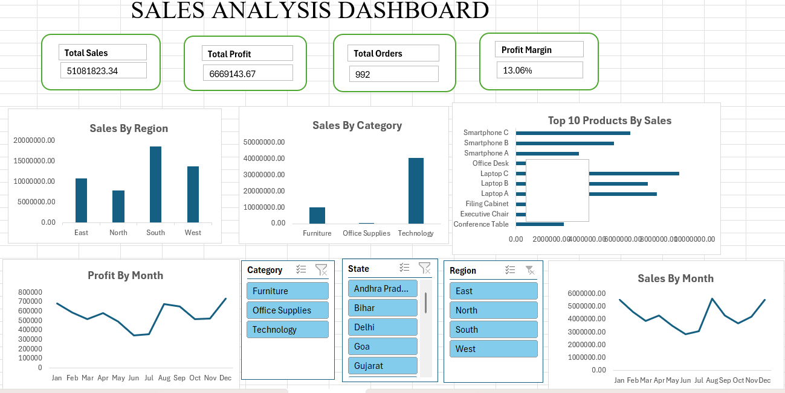

# Excel Sales Analysis Dashboard

## Project Overview

This project is an end-to-end Sales Analysis project built using Microsoft Excel.

The project covers the complete data analysis workflow, starting from raw data cleaning and transformation to data analysis, KPI calculation, visualization, and an interactive dashboard.

## Objective

The objective of this project is to analyze sales performance and identify patterns and trends across regions, categories, states, products, sales, and profit.

## Tools Used

- Microsoft Excel
- Power Query
- PivotTables
- PivotCharts
- Excel Formulas
- Slicers

## Project Workflow

Raw Data  
↓  
Data Cleaning  
↓  
Data Transformation  
↓  
Data Analysis  
↓  
KPI Calculation  
↓  
Data Visualization  
↓  
Interactive Dashboard  
↓  
Business Insights

## Dataset

The dataset contains sales transaction information including:

- Order ID
- Order Date
- Customer ID
- Customer Name
- Region
- State
- City
- Category
- Sub-Category
- Product
- Quantity
- Sales
- Discount
- Profit

## Data Cleaning

The raw dataset was cleaned and prepared for analysis using Excel and Power Query.

The cleaning process included:

- Handling missing values
- Removing duplicate records
- Checking and correcting data types
- Reviewing data consistency
- Preparing the dataset for analysis

After cleaning, the final dataset contained 992 valid records.

## Analysis Performed

PivotTables were created to analyze:

- Sales by Region
- Sales by Category
- Profit by Region
- Profit by Category
- Monthly Sales
- Monthly Profit
- Sales by State
- Top 10 Products by Sales
- Top 10 Products by Profit
- Regional Sales and Profit Performance

## Key Performance Indicators

The dashboard includes the following KPIs:

| KPI | Value |
|---|---:|
| Total Sales | ₹51,081,823.34 |
| Total Profit | ₹6,669,143.67 |
| Total Orders | 992 |
| Total Quantity | 3,893 |
| Average Order Value | ₹51,493.77 |
| Profit Margin | 13.06% |

## Dashboard

The interactive dashboard includes:

- KPI cards
- Sales by Region
- Sales by Category
- Monthly Sales Trend
- Monthly Profit Trend
- Top 10 Products by Sales
- Region slicer
- Category slicer
- State slicer

### Dashboard Preview

## Project Files

### 01_Raw_Data

Contains the original raw dataset before cleaning.

### 02_Analysis_and_Dashboard

Contains the final Excel workbook with:

- Cleaned data
- PivotTables
- KPI calculations
- Dashboard
- Interactive slicers

It also contains the dashboard screenshot for preview.

## Skills Demonstrated

- Data Cleaning
- Data Transformation
- Power Query
- Excel Formulas
- PivotTables
- PivotCharts
- KPI Development
- Data Visualization
- Dashboard Design
- Interactive Data Analysis
- Business Insights

## Conclusion

This project demonstrates the complete process of transforming raw sales data into an interactive Excel dashboard that can be used to analyze sales and profitability and support data-driven decision making.
